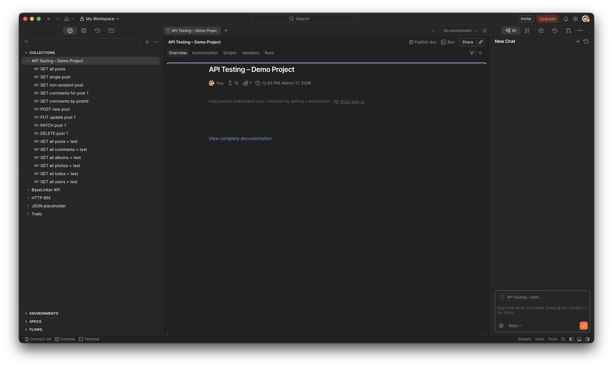
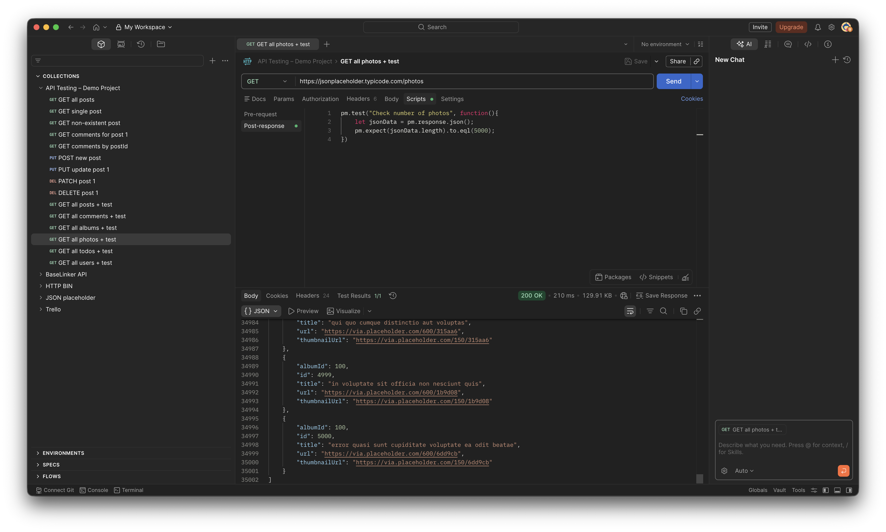

# REST API Testing Exercises – Postman

A collection of API tests written in Postman as part of learning API testing.

## Tested endpoints
- /posts
- /comments
- /albums
- /photos
- /users
- /todos

## Test coverage
- HTTP status code validation
- Response body structure validation
- Record count validation

## API source
https://jsonplaceholder.typicode.com

## Screenshots

### 1. Collection overview

*Full test collection covering 6 endpoints: posts, comments, albums, photos, users, todos*

### 2. Test script & response

*Test script with HTTP status and response body preview*

### 3. Test results

*Test results – all assertions passed*

--------------------------------------------------

# REST API - testowanie w programie Postman

Kolekcja testów napisanych w Postmanie jako część nauki testowania API.

## Testowane endpointy
- /posts
- /comments
- /albums
- /photos
- /users
- /todos

## Zakres testów
- Walidacja statusów HTTP
- Sprawdzanie struktury response body
- Walidacja liczby zwracanych rekordów

## Źródło API
https://jsonplaceholder.typicode.com

## Zdjęcia

### 1. Podgląd kolekcji

*Kolekcja testów obejmująca 6 endpointów: posty, komentarze, albumy, zdjęcia, użytkownicy, zadania do zrobienia*

### 2. Kod testu i odpowiedź serwera

*Skrypt testowy z walidacją statusu HTTP 200 oraz podgląd odpowiedzi*

### 3. Wyniki testów

*Wyniki testów – wszystkie asercje* zaliczone*

